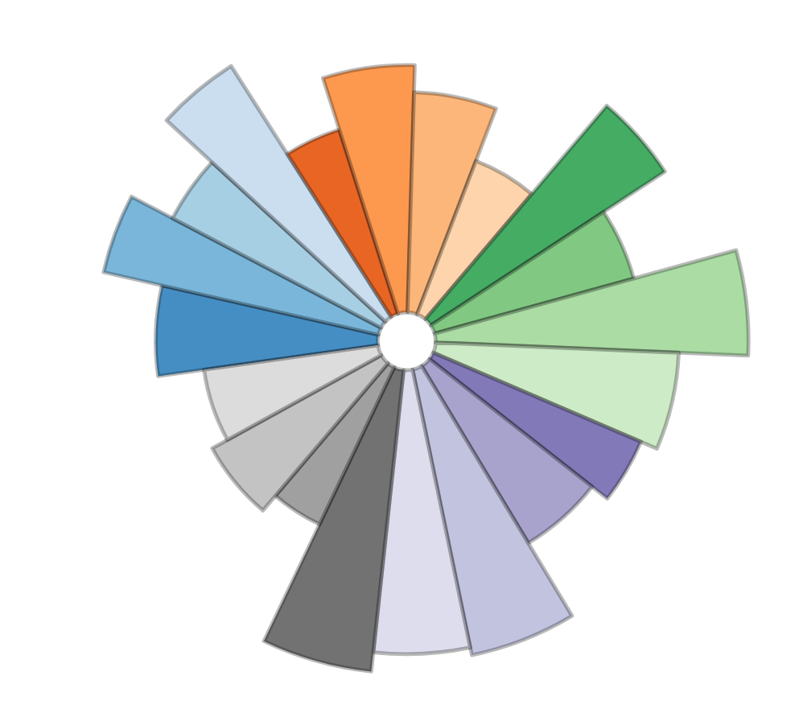

# Korrigeeritud RK2019 valimiskompass

Põhineb koodil:

* https://github.com/UrbanInstitute/quick-quiz (küsitlus)
* https://github.com/xuchen81/xuchen-81/ (viskev D3 andmegraafik)

Seletus:

* http://piraadipartei.ee/kes-kardab-zuzut

Edasiarendused:

* Põhimõtteliselt saaks sellest lihtsa vaevaga päris kompassi ka teha — aga keda see huvitaks?

